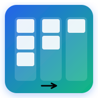
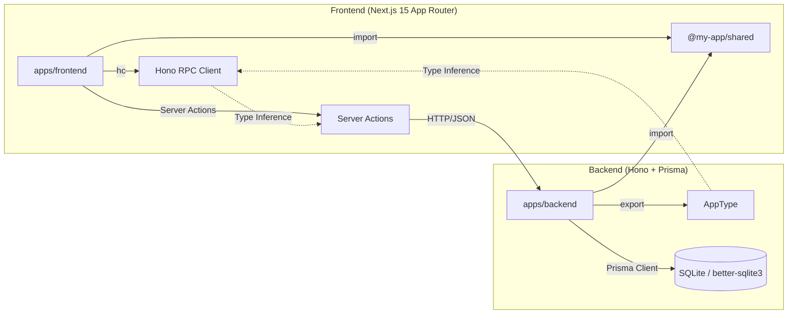

<p align="center">
  <picture>
    <source media="(prefers-color-scheme: dark)" srcset="docs/images/logo.svg">
    
  </picture>
</p>

<p align="center">
  <em>End-to-End 型安全なフルスタック・カンバンアプリ</em>
</p>

<p align="center">
  <a href="https://github.com/ryu1/hono-react-board-app/actions/workflows/ci.yml">
    
  </a>
  <a href="https://pnpm.io/">
    
  </a>
  <a href="https://nodejs.org/">
    
  </a>
  <a href="https://hono.dev/">
    
  </a>
  <a href="https://nextjs.org/">
    
  </a>
  <a href="https://www.prisma.io/">
    
  </a>
  <a href="https://zod.dev/">
    
  </a>
  <a href="https://conform.guide/">
    
  </a>
  <a href="https://vitest.dev/">
    
  </a>
  <a href="https://playwright.dev/">
    
  </a>
  <a href="https://www.typescriptlang.org/">
    
  </a>
</p>

---

## 🚀 概要

**Hono RPC × Next.js 15 Kanban App** は、フルスタック TypeScript による **End-to-End 型安全** なインタラクティブ・タスクボード（カンバンアプリ）です。

### 主な特長

- 🔒 **完全な型安全性**: Hono RPC (`hc<AppType>`) によるフロント・バック間の型共有、OpenAPI 定義不要
- ⚡ **モダンなデータフロー**: Next.js 15 App Router (RSC + Server Actions) でサーバーファースト
- 📦 **最小依存**: 認証・WebSocket・重い状態管理ライブラリなし、コア機能に集中
- 🎯 **モダンスタック**: React 19, Next.js 15 (RSC/Server Actions), Prisma ORM, Zod, Conform
- 🧪 **テストファースト**: Vitest + React Testing Library + Playwright で TDD 実践
- 🎨 **ゼロ CSS**: インラインスタイル (`React.CSSProperties`) のみ、ビルド不要

---

## 📁 プロジェクト構造

```
hono-react-board-app/
├── apps/
│   ├── backend/          # Hono + Prisma ORM + better-sqlite3
│   └── frontend/         # Next.js 15 App Router (RSC + Server Actions)
├── packages/
│   └── shared/           # 共有 Zod スキーマ・型 (@my-app/shared)
├── apps/e2e-tests/       # Playwright E2E テスト
├── docs/                 # 設計ドキュメント
└── pnpm-workspace.yaml   # pnpm ワークスペース設定
```

---

## 🛠 技術スタック

詳細は [`docs/tech.md`](docs/tech.md) を参照してください。

| カテゴリ | 技術 |
|----------|------|
| Package Manager | pnpm 12.8.2 (Workspace) |
| Runtime | Node.js 26.10.0 |
| Backend | Hono 4.6, Prisma ORM 7.10, better-sqlite3 |
| Frontend | React 19, Next.js 15.1 (App Router, RSC, Server Actions), Conform 1.2 |
| Validation | Zod 3.25 (prisma-zod-generator で自動生成) |
| Testing | Vitest 3.0, React Testing Library 16, Playwright 1.63 |
| Dev Tools | TypeScript 5.6, concurrently |

---

## 🏗 アーキテクチャ



- **型推論フロー**: Backend `AppType` → `hc<AppType>` → Frontend 完全型付き RPC クライアント
- **スキーマ単一管理**: Prisma スキーマ → `prisma-zod-generator` → Zod → `@my-app/shared` → Frontend/Backend 双方で利用
- **データ取得**: RSC (`page.tsx`) でサーバーサイド完結
- **ミューテーション**: Server Actions (`actions.ts`) → RPC → Backend API

詳細は [`docs/architecture.md`](docs/architecture.md) を参照

---

## 📚 ドキュメント

| ドキュメント | 内容 |
|-------------|------|
| [`docs/product.md`](docs/product.md) | プロダクトビジョン・要件・ユーザーストーリー・成功の定義 |
| [`docs/architecture.md`](docs/architecture.md) | システム構成・データモデル・コンポーネント設計・データフロー |
| [`docs/design.md`](docs/design.md) | GUI デザイン・カラーパレット・タイポグラフィ・コンポーネント仕様・アクセシビリティ |
| [`docs/api.md`](docs/api.md) | **REST API 仕様の唯一の正本** (エンドポイント・リクエスト/レスポンス・エラー・バリデーション) |
| [`docs/tech.md`](docs/tech.md) | 技術選定理由・制約・パフォーマンス要件・ADR |
| [`docs/conventions.md`](docs/conventions.md) | コーディング規約・命名規則・テスト規約・Git 規約・セットアップ・CI/CD |
| [`docs/security.md`](docs/security.md) | 脅威モデル・バリデーション・インジェクション対策・通信セキュリティ・既知リスク |
| [`docs/operations.md`](docs/operations.md) | 環境変数・日常運用・ログ・障害切り分け・デプロイチェックリスト |
| [`docs/review.md`](docs/review.md) | レビュー観点・PR プロセス・承認ルール・コメントガイドライン・セルフレビュー |
| [`docs/glossary.md`](docs/glossary.md) | ユビキタス言語・英日対応表・命名規則パターン |
| [`docs/documentation-guideline.md`](docs/documentation-guideline.md) | ドキュメント作成・更新規約・完了チェックリスト |

---

## 🚀 クイックスタート

詳細なセットアップ手順は [`docs/conventions.md#5-セットアップ手順`](docs/conventions.md#5-セットアップ手順) を参照してください。

```bash
# 1. 依存インストール (Prisma generate 自動実行)
pnpm install

# 2. DB セットアップ (スキーマ反映 + シード)
pnpm --filter backend db:push
pnpm --filter backend db:seed

# 3. 開発サーバー起動 (Backend: 3001, Frontend: 3000)
pnpm dev
```

ブラウザで `http://localhost:3000` を開くとカンバンボードが表示されます。

---

## 🧪 テスト・品質チェック

詳細は [`docs/conventions.md#8-デバッグトラブルシューティング`](docs/conventions.md#8-デバッグトラブルシューティング) を参照してください。

```bash
# 全テスト実行 (E2E 除く)
pnpm test

# パッケージ別
pnpm test:backend
pnpm test:frontend
pnpm test:shared

# E2E テスト
pnpm test:e2e

# 型チェック
pnpm typecheck

# リント・フォーマット
pnpm lint
pnpm lint --fix  # 自動修正
```

---

## 📝 開発ワークフロー

1. **Issue 作成** → 機能・バグ・改善をチケット化
2. **ブランチ作成** → `feature/*`, `fix/*`, `chore/*`
3. **TDD 実装** → 失敗テスト作成 → 実装 → リファクタ → コミット
4. **ドキュメント同期** → 同一コミットで `docs/` 更新 (必須)
5. **PR 作成** → セルフレビュー後、レビュアーアサイン
6. **レビュー・承認** → `🔴 Must Fix` すべて解決で Approve
7. **マージ** → Squash & Merge → `main` へ

詳細: [`docs/conventions.md#7-開発ワークフロー`](docs/conventions.md#7-開発ワークフロー)

---

## 🔗 重要リンク

- **API 仕様**: [`docs/api.md`](docs/api.md) (唯一の正本)
- **設計ドキュメント一覧**: [`docs/`](docs/)
- **用語定義**: [`docs/glossary.md`](docs/glossary.md)
- **AI アシスタント指示**: [`AGENTS.md`](AGENTS.md)
- **リポジトリ**: [`github.com/ryu1/hono-react-board-app`](https://github.com/ryu1/hono-react-board-app)

---

## 🤝 コントリビューション

Issue・PR 大歓迎です！  
コントリビューション前には [`docs/conventions.md`](docs/conventions.md) と [`docs/review.md`](docs/review.md) を一読ください。