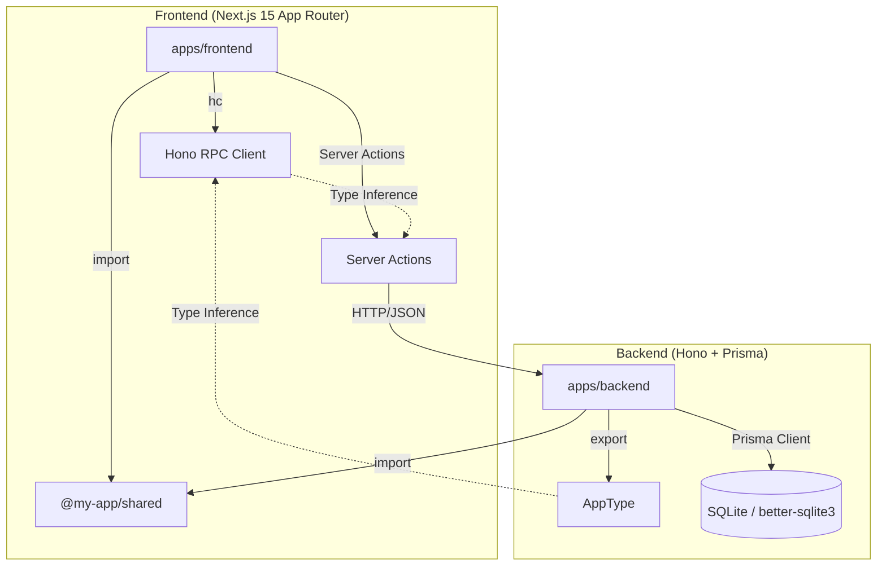
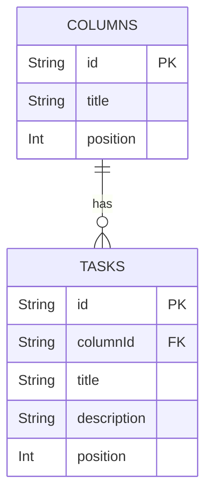
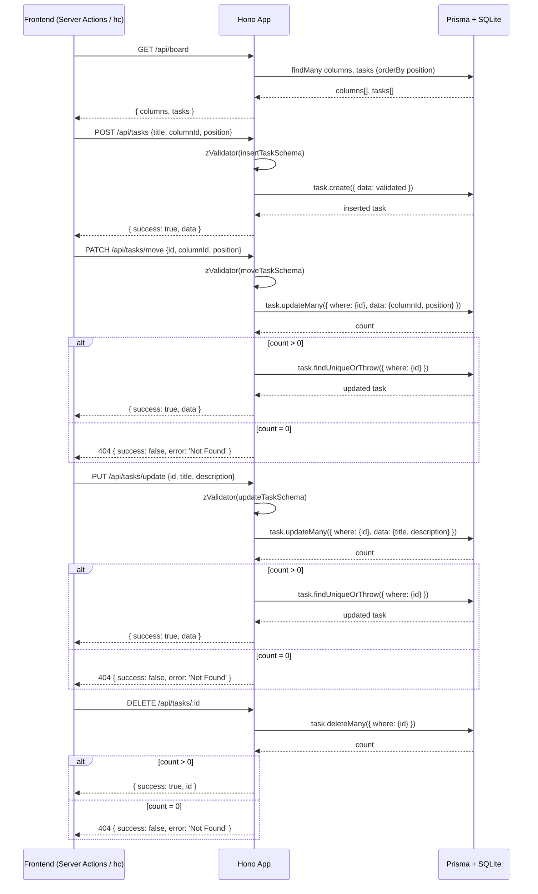
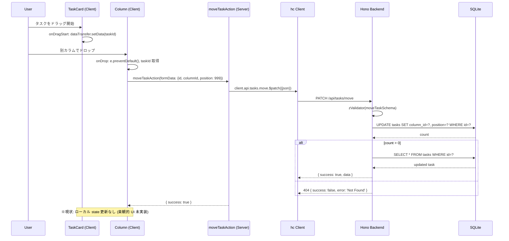

# アーキテクチャ設計書

## 1. システム全体構成



### コンポーネント関係

| コンポーネント | 役割 | 技術 |
|--------------|------|------|
| `apps/frontend` | Next.js 15 App Router (RSC + Server Actions) | React 19, Next.js 15 |
| `apps/backend` | REST API サーバー | Hono, Prisma ORM |
| `packages/shared` | 共有 Zod スキーマ | Zod, TypeScript |
| `SQLite (better-sqlite3)` | 永続化ストレージ | Prisma Adapter |

---

## 2. ディレクトリ構造

```
hono-react-board-app/
├── pnpm-workspace.yaml
├── package.json                    # Root scripts + concurrently
├── .tool-versions                  # Node.js / pnpm バージョン固定
├── AGENTS.md                       # AI アシスタント指示
├── README.md                       # リポジトリ概要・ドキュメント目次
├── docs/                           # 設計ドキュメント
│   ├── product.md
│   ├── architecture.md
│   ├── design.md
│   ├── api.md
│   ├── tech.md
│   ├── conventions.md
│   ├── security.md
│   ├── operations.md
│   ├── review.md
│   ├── glossary.md
│   └── documentation-guideline.md
├── apps/
│   ├── backend/                    # Hono + Prisma
│   │   ├── src/
│   │   │   ├── db/
│   │   │   │   ├── schema.ts       # Prisma Zod スキーマのアダプタ
│   │   │   │   ├── index.ts        # DB 接続 (PrismaClient + better-sqlite3 adapter)
│   │   │   │   └── seed.ts         # 初期データ投入
│   │   │   ├── index.ts            # Hono アプリ + RPC ルート + AppType export
│   │   │   ├── server.ts           # Node.js サーバー エントリーポイント (@hono/node-server)
│   │   │   └── index.test.ts       # API ルートテスト
│   │   ├── prisma/
│   │   │   └── schema.prisma       # Prisma スキーマ + @zod 注釈
│   │   ├── prisma.config.ts        # datasource URL 設定
│   │   ├── vitest.config.ts
│   │   └── package.json
│   └── frontend/                   # Next.js 15 App Router
│       ├── app/
│       │   ├── client.ts           # Hono RPC クライアント (hc)
│       │   ├── actions.ts          # Server Actions (create/delete/update/move)
│       │   ├── page.tsx            # RSC: ボードページ (データ取得 + Board コンポーネント)
│       │   ├── layout.tsx          # ルートレイアウト + metadata
│       │   ├── test-setup.ts       # RTL クリーンアップ
│       │   └── page.test.tsx       # ページテスト
│       ├── components/
│       │   ├── Board.tsx           # ボードコンポーネント (Client Component)
│       │   ├── Column.tsx          # カラムコンポーネント (Client Component)
│       │   ├── TaskCard.tsx        # タスクカード (Client Component)
│       │   ├── CreateForm.tsx      # 作成フォーム (Client Component + Conform)
│       │   └── *.test.tsx          # コンポーネントテスト
│       ├── next.config.ts
│       ├── vitest.config.ts
│       ├── tsconfig.json
│       └── package.json
├── packages/
│   └── shared/                     # 共有スキーマ
│       ├── src/
│       │   ├── index.ts            # Zod スキーマ再エクスポート
│       │   └── index.test.ts
│       ├── vitest.config.ts
│       └── package.json
└── apps/e2e-tests/                 # Playwright E2E テスト
    ├── src/
    │   └── board.spec.ts
    ├── playwright.config.ts
    └── package.json
```

---

## 3. データモデル



### テーブル定義 (Prisma `schema.prisma`)

#### `Column` モデル (`columns` テーブル)
| フィールド | 型 | 制約 | 説明 |
|-----------|-----|------|------|
| `id` | `String` | `@id` (PK) | カラム一意識別子 (例: `col-todo`) |
| `title` | `String` | NOT NULL, `@zod.min(1)` | 表示名 (例: `Todo 📝`) |
| `position` | `Int` | NOT NULL | 表示順 (0, 1, 2) |
| `tasks` | `Task[]` | リレーション | 所属タスク (カスケード削除) |

#### `Task` モデル (`tasks` テーブル)
| フィールド | 型 | 制約 | 説明 |
|-----------|-----|------|------|
| `id` | `String` | `@id` (PK) | タスク一意識別子 (UUID) |
| `columnId` | `String` | `@map("column_id")`, FK | 所属カラム (`Column.id` 参照, `onDelete: Cascade`) |
| `title` | `String` | NOT NULL, `@zod.min(1)` | タスクタイトル (1 文字以上) |
| `description` | `String?` | NULLABLE | タスク説明 |
| `position` | `Int` | NOT NULL | カラム内表示順 |
| `column` | `Column` | リレーション | 親カラム |

---

## 4. コンポーネント設計

### 4.1 共有パッケージ (`@my-app/shared`)

**責務**: バックエンドの Prisma スキーマから `prisma-zod-generator` で自動生成される Zod スキーマをフロントエンドへ中継・エクスポート

```typescript
// packages/shared/src/index.ts
export { insertTaskSchema, insertColumnSchema } from '../../../apps/backend/src/db/schema'
export type { CreateTaskInput } from '../../../apps/backend/src/db/schema'
```

**エクスポート:**
- `insertTaskSchema` - タスク作成用 Zod スキーマ (`title` 必須, `description` 任意, `position` coerce)
- `insertColumnSchema` - カラム作成用 Zod スキーマ (`title` 必須)
- `CreateTaskInput` - `z.infer<typeof insertTaskSchema>` 型

---

### 4.2 バックエンド (`apps/backend`)

#### 4.2.1 データベース層 (`src/db/`)

| ファイル | 責務 |
|----------|------|
| `schema.ts` | `prisma-zod-generator` 生成スキーマ (`TaskModelSchema`, `ColumnModelSchema`) を import し、フロントエンド用に調整 (`omit`, `extend`, `nullish`, `coerce`) |
| `index.ts` | `@prisma/adapter-better-sqlite3` で better-sqlite3 接続 + `PrismaClient` export |
| `seed.ts` | べき等シード: 3 カラム (Todo/In Progress/Done) を初回のみ投入 (`upsert`) |

#### 4.2.2 API ルート (`src/index.ts`)



**エンドポイント一覧** → 詳細は [`docs/api.md`](api.md) を参照

#### 4.2.3 サーバー起動 (`src/server.ts`)

```typescript
import { serve } from '@hono/node-server'
import app from './index'

const port = Number(process.env.PORT ?? 3000)
serve({ fetch: app.fetch, port })
```

#### 4.2.4 型定義・エクスポート

```typescript
// apps/backend/src/index.ts
export type AppType = typeof routes  // Hono RPC 用の型エクスポート
export default app
```

---

### 4.3 フロントエンド (`apps/frontend`)

#### 4.3.1 RPC クライアント (`app/client.ts`)

```typescript
import { hc } from 'hono/client'
import type { AppType } from '../../backend/src/index'

export const client = hc<AppType>('http://localhost:3001/')
```

- `AppType` から全エンドポイントの型を推論
- ベース URL は開発時 `http://localhost:3001/`

#### 4.3.2 Server Actions (`app/actions.ts`)

```typescript
'use server'

import { client } from './client'
import { insertTaskSchema } from '@my-app/shared'
import { parseWithZod } from '@conform-to/zod'

export async function createTaskAction(formData: FormData) { ... }
export async function deleteTaskAction(formData: FormData) { ... }
export async function updateTaskAction(formData: FormData) { ... }
export async function moveTaskAction(formData: FormData) { ... }
```

- `'use server'` ディレクティブでサーバー専用関数化
- Conform `parseWithZod` でフォームデータをバリデーション
- RPC クライアント経由でバックエンド API 呼び出し
- `submission.reply()` で Conform 対応レスポンス返却

#### 4.3.3 ページコンポーネント (`app/page.tsx` - RSC)

```typescript
import { client } from './client'
import Board from '@/components/Board'

export default async function BoardPage() {
  const res = await client.api.board.$get()
  if (!res.ok) throw new Error('データ取得失敗')
  const { columns, tasks } = await res.json()
  
  return <Board initialColumns={columns} initialTasks={tasks} />
}
```

- **React Server Component (RSC)**: サーバーでデータ取得、HTML ストリーミング
- `client.api.board.$get()` で初期データ取得
- Client Component (`Board`) に初期データを props で渡す

#### 4.3.4 ボードコンポーネント (`components/Board.tsx` - Client Component)

```typescript
'use client'

import { useState } from 'react'
import { moveTaskAction } from '../app/actions'
import Column from './Column'

export default function Board({ initialColumns, initialTasks }: BoardProps) {
  const [tasks, setTasks] = useState<Task[]>(initialTasks)

  const handleTaskMove = async (taskId: string, targetColumnId: string) => {
    const formData = new FormData()
    formData.set('id', taskId)
    formData.set('columnId', targetColumnId)
    formData.set('position', '999')
    await moveTaskAction(formData)
    // 注: 現状楽観的 UI 未実装。Server Action 完了後は再取得なし
  }
  // ...
}
```

- `'use client'` でクライアントコンポーネント化
- `useState` でローカル タスク状態管理
- Server Actions (`moveTaskAction` 等) でミューテーション実行

#### 4.3.5 カラム・タスクカード・作成フォーム

| コンポーネント | 責務 | 主なフック/API |
|--------------|------|----------------|
| `Column.tsx` | カラム表示、ドロップターゲット、作成フォーム配置 | `onDragOver`, `onDrop`, `CreateForm` |
| `TaskCard.tsx` | タスク表示、ドラッグソース、インライン編集、削除 | `useState` (編集モード), `useActionState` (更新/削除), `onDragStart` |
| `CreateForm.tsx` | タスク作成フォーム、Conform + Zod バリデーション | `useActionState` (createTaskAction), `useForm`, `parseWithZod` |

#### 4.3.6 レイアウト (`app/layout.tsx`)

```typescript
export const metadata: Metadata = {
  title: '🚀 超高速フルスタック・タスクボード',
  description: 'End-to-End 型安全なフルスタック・カンバンアプリ',
}

export default function RootLayout({ children }) {
  return (
    <html lang="ja">
      <head>...</head>
      <body><div id="root">{children}</div></body>
    </html>
  )
}
```

- Next.js `Metadata` API で SEO 対応
- ルートレイアウトとして全ページ共通 UI 提供

---

## 5. データフロー

```mermaid
flowchart LR
    subgraph Frontend_RSC [RSC: page.tsx]
        Load[client.api.board.$get()]
    end

    subgraph Frontend_Client [Client Components]
        Props[initialColumns, initialTasks]
        State[useState tasks]
        Actions[Server Actions: create/delete/update/move]
        DnD[Drag & Drop: HTML5 API]
    end

    subgraph Backend [Hono + Prisma]
        ZVal[zValidator: Zod バリデーション]
        Prisma[Prisma Client]
        Seed[起動時 seed()]
    end

    Load -->|HTTP GET| ZVal
    Actions -->|HTTP POST/PATCH/PUT/DELETE| ZVal
    ZVal --> Prisma
    Prisma -->|SQLite| DB[(local.db)]
    Seed --> Prisma
    
    Props -.->|初期データ| State
    DnD -.->|移動操作| Actions
    Actions -.->|完了| State[※楽観的更新なし]
```

**注意**: 現状、Server Action 実行後のローカル状態自動更新（楽観的 UI や再取得）は未実装。手動リロードまたは実装追加が必要。

---

## 6. エラーハンドリング方針

### 6.1 バックエンド
| 種別 | 対応 | HTTP ステータス |
|------|------|----------------|
| バリデーション失敗 | `zValidator` 自動処理、エラー詳細返却 | 400 |
| Prisma エラー | try-catch で捕捉、ログ出力後汎用エラー | 500 |
| リソース不存在 | `updateMany`/`deleteMany` の count で判定 | 404 |

### 6.2 フロントエンド
| 種別 | 対応 |
|------|------|
| RSC データ取得失敗 | `throw new Error` → Next.js Error Boundary (`error.tsx` 未実装) |
| Server Action 失敗 | Conform `submission.reply()` でフォームにエラー表示 (`CreateForm`) |
| `useActionState` 失敗 | 戻り値 `{ success: false, error }` でハンドリング (`TaskCard`) |
| ネットワークエラー | ブラウザ標準エラー、トースト通知未実装 |

---

## 7. ユースケース図

```mermaid
useCaseDiagram
    actor User
    
    User --> UC1: ボード表示 (RSC)
    User --> UC2: タスク作成 (Server Action)
    User --> UC3: タスク移動 (Server Action + DnD)
    User --> UC4: タスク編集 (Server Action)
    User --> UC5: タスク削除 (Server Action)
    
    UC1 --> Backend: GET /api/board
    UC2 --> Backend: POST /api/tasks
    UC3 --> Backend: PATCH /api/tasks/move
    UC4 --> Backend: PUT /api/tasks/update
    UC5 --> Backend: DELETE /api/tasks/:id
```

---

## 8. クラス図（主要インターフェース）

```mermaid
classDiagram
    class AppType {
        +api: APIRoutes
    }
    
    class APIRoutes {
        +board: { $get(): BoardResponse }
        +tasks: { 
            $post(json: CreateTaskInput): TaskResponse
            $delete(param: {id: string}): DeleteResponse
            update: { $put(json: UpdateTaskInput): TaskResponse }
            move: { $patch(json: MoveTaskInput): TaskResponse }
        }
    }
    
    class BoardResponse {
        +columns: Column[]
        +tasks: Task[]
    }
    
    class Column {
        +id: string
        +title: string
        +position: number
    }
    
    class Task {
        +id: string
        +columnId: string
        +title: string
        +description: string | null
        +position: number
    }
    
    class CreateTaskInput {
        +id: string
        +columnId: string
        +title: string
        +description?: string
        +position: number
    }
    
    class MoveTaskInput {
        +id: string
        +columnId: string
        +position: number
    }
    
    class UpdateTaskInput {
        +id: string
        +title: string
        +description: string | null
    }
    
    AppType --> APIRoutes
    APIRoutes --> BoardResponse
    APIRoutes --> CreateTaskInput
    APIRoutes --> MoveTaskInput
    APIRoutes --> UpdateTaskInput
    BoardResponse --> Column
    BoardResponse --> Task
```

---

## 9. シーケンス図：タスク移動（Drag & Drop → Server Action）

