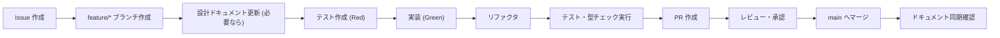

# 規約・手順書

## 1. フォルダ・ファイル構成

### 1.1 ディレクトリの役割

```
hono-react-board-app/
├── apps/
│   ├── backend/           # Hono API サーバー + Prisma
│   │   ├── src/
│   │   │   ├── db/        # DB 接続・スキーマ・シード
│   │   │   ├── index.ts   # Hono アプリ + ルート定義 + AppType export
│   │   │   ├── server.ts  # Node.js サーバー エントリーポイント
│   │   │   └── *.test.ts  # コロケーションテスト
│   │   ├── prisma/
│   │   │   └── schema.prisma  # Prisma スキーマ + @zod 注釈
│   │   ├── prisma.config.ts
│   │   ├── vitest.config.ts
│   │   └── package.json
│   ├── frontend/          # Next.js 15 App Router
│   │   ├── app/
│   │   │   ├── client.ts          # Hono RPC クライアント (hc)
│   │   │   ├── actions.ts         # Server Actions (create/delete/update/move)
│   │   │   ├── page.tsx           # RSC: ボードページ
│   │   │   ├── layout.tsx         # ルートレイアウト + metadata
│   │   │   ├── test-setup.ts      # RTL クリーンアップ
│   │   │   └── *.test.tsx         # ページ・アクションテスト
│   │   ├── components/    # Client Components
│   │   │   ├── Board.tsx
│   │   │   ├── Column.tsx
│   │   │   ├── TaskCard.tsx
│   │   │   ├── CreateForm.tsx
│   │   │   └── *.test.tsx
│   │   ├── next.config.ts
│   │   ├── vitest.config.ts
│   │   ├── tsconfig.json
│   │   └── package.json
│   └── e2e-tests/         # Playwright E2E テスト
│       ├── src/
│       │   └── board.spec.ts
│       ├── playwright.config.ts
│       └── package.json
├── packages/
│   └── shared/            # 共有 Zod スキーマ・型
│       ├── src/
│       │   ├── index.ts   # Zod スキーマ再エクスポート
│       │   └── index.test.ts
│       ├── vitest.config.ts
│       └── package.json
├── docs/                  # 設計ドキュメント
├── pnpm-workspace.yaml
├── package.json           # ルートスクリプト
├── .tool-versions         # Node/pnpm バージョン固定
├── AGENTS.md              # AI アシスタント指示
└── README.md
```

### 1.2 ファイル配置ルール

| 種別 | 配置先 | 命名規則 |
|------|--------|----------|
| RSC ページ | `apps/frontend/app/` | `page.tsx`, `layout.tsx` |
| Server Actions | `apps/frontend/app/` | `actions.ts` |
| Client Components | `apps/frontend/components/` | `{Feature}.tsx` (PascalCase) |
| RPC クライアント | `apps/frontend/app/` | `client.ts` |
| テストファイル | 実装ファイルと同階層 | `{file}.test.{ts,tsx}` |
| 共有スキーマ | `packages/shared/src/index.ts` | 単一ファイルで再エクスポート |
| DB スキーマ | `apps/backend/src/db/schema.ts` | Prisma Zod 生成スキーマのアダプタ |
| API ルート | `apps/backend/src/index.ts` | 単一ファイルで全ルート定義 |
| Prisma スキーマ | `apps/backend/prisma/schema.prisma` | `@zod` 注釈で Zod 生成制御 |

---

## 2. コーディング規約

### 2.1 TypeScript

```typescript
// 必須設定 (tsconfig.json)
{
  "compilerOptions": {
    "strict": true,
    "noUncheckedIndexedAccess": true,
    "exactOptionalPropertyTypes": true,
    "noImplicitReturns": true,
    "noFallthroughCasesInSwitch": true
  }
}
```

| 規約 | 詳細 |
|------|------|
| **型推論優先** | 明示的型アノテーションは必要最小限 (関数引数・戻り値・複雑なジェネリック) |
| **`any` 禁止** | `unknown` + 型ガード、またはジェネリックで代替 |
| **`enum` 不使用** | `const` オブジェクト + `as const` またはユニオン型 |
| **`namespace` 不使用** | ES Modules (`import`/`export`) で管理 |
| **非同期関数** | `async`/`await` 必須、`.then()` チェーン禁止 |
| **エラーハンドリング** | `try`/`catch` + 早期リターン、Result 型未導入 |
| **RSC/Client Component 分離** | デフォルト RSC、`'use client'` で明示的クライアント化 |

### 2.2 命名規則

詳細: [`docs/glossary.md`](glossary.md#命名規則) を参照

| 対象 | 規則 | 例 |
|------|------|-----|
| **ファイル (TS/TSX)** | kebab-case | `page.tsx`, `board.tsx`, `actions.ts` |
| **ファイル (テスト)** | `{file}.test.{ts,tsx}` | `board.test.tsx`, `actions.test.ts` |
| **ディレクトリ** | kebab-case | `app/`, `components/`, `src/db/` |
| **変数・関数** | camelCase | `fetchBoard`, `createTask`, `handleTaskMove` |
| **定数** | UPPER_SNAKE_CASE | `MAX_TASKS_PER_COLUMN` |
| **型・インターフェース** | PascalCase | `Task`, `BoardProps`, `CreateTaskInput` |
| **型パラメータ** | PascalCase (単一文字可) | `T`, `TData`, `TError` |
| **React Components** | PascalCase | `Board`, `TaskCard`, `CreateForm` |
| **Server Actions** | `{verb}{Noun}Action` | `createTaskAction`, `moveTaskAction` |
| **カスタムフック** | `use` + PascalCase | `useBoard`, `useOptimisticTasks` |
| **Zod スキーマ** | `*Schema` suffix | `insertTaskSchema`, `moveTaskSchema` |
| **RPC クライアントメソッド** | `$` prefix (Hono 標準) | `$get()`, `$post()`, `$patch()` |

### 2.3 インポート順序

```typescript
// 1. 外部ライブラリ (アルファベット順)
import { Hono } from 'hono'
import { cors } from 'hono/cors'
import { z } from 'zod'

// 2. 内部モジュール (相対パス、深い順)
import { db } from './db'
import { tasks, insertTaskSchema } from './db/schema'
import { seed } from './db/seed'

// 3. 型のみインポート (分離)
import type { AppType } from './index'
```

### 2.4 スタイリング規約

| 規約 | 詳細 |
|------|------|
| **インラインスタイルのみ** | `React.CSSProperties` オブジェクトで定義 |
| **CSS ファイル作成禁止** | `.css`, `.module.css`, `.scss` 等不使用 |
| **Tailwind 等ユーティリティ不使用** | クラス名ベーススタイリング禁止 |
| **スタイル定義** | `const styles: Record<string, React.CSSProperties> = { ... }` |
| **使用** | `<div style={styles.container}>` |
| **メディアクエリ** | インライン不可、将来 CSS 変数移行時に対応 |

### 2.5 React / Next.js 固有規約

| 規約 | 詳細 |
|------|------|
| **RSC デフォルト** | `'use client'` なしでサーバーコンポーネント |
| **Client Component** | `'use client'` ディレクティブ必須 (ファイル先頭) |
| **Server Actions** | `'use server'` ディレクティブ必須 (関数またはファイル先頭) |
| **関数コンポーネント** | `function ComponentName() {}` (アロー関数禁止) |
| **Props 型** | `interface ComponentNameProps {}` 同一ファイル内定義 |
| **Children** | `React.ReactNode` 型、明示的受け取り時のみ `props.children` |
| **イベントハンドラ** | `handleXxx` / `onXxx` 命名 |
| **フック呼び出し** | コンポーネントトップレベル、条件分岐内禁止 |
| **キー** | 安定した一意 ID (`task.id`)、配列インデックス禁止 |
| **`useActionState`** | Server Action 連携時は `useActionState` 使用 (React 19) |

---

## 3. テスト規約

### 3.1 テスト種別・配置

| 種別 | 配置 | ツール | 責務 |
|------|------|--------|------|
| **単体テスト** | `*.test.ts` / `*.test.tsx` (同階層) | Vitest | 純関数、スキーマ、ユーティリティ、Actions |
| **統合テスト** | `*.test.tsx` (同階層) | Vitest + RTL | Client Components、Server Actions、フック |
| **E2E テスト** | `apps/e2e-tests/` | Playwright | ユーザーシナリオ全体、実ブラウザ |

### 3.2 テスト命名・構造

```typescript
// describe ブロック: 機能単位
describe('insertTaskSchema', () => {
  // it ブロック: 単一振る舞い、日本語で「〜する」「〜ではない」形式
  it('タイトルが空の場合、バリデーションエラーになる', () => { ... })
  it('有効なタスクデータの場合、パース成功する', () => { ... })
})
```

### 3.3 テスト原則 (TDD 必須)

1. **Red**: 失敗するテストを書く
2. **Green**: 最小実装でパスさせる
3. **Refactor**: 重複除去・可読性向上
4. **Commit**: テスト+実装を同一コミット

### 3.4 モック・スタブ

| 対象 | 方針 |
|------|------|
| **外部 API (RPC)** | `vi.mock` でモジュールモック、戻り値は `vi.fn()` |
| **Server Actions** | `vi.mock('@/app/actions')` でモック |
| **Next.js ナビゲーション** | `vi.mock('next/navigation')` 必要時のみ |
| **Date/Random** | `vi.useFakeTimers()`, `vi.spyOn(crypto, 'randomUUID')` |
| **DB** | 単体テストではモック、統合テストでは実 DB (local.db) 使用 |

### 3.5 カバレッジ方針

- **目標**: 行カバレッジ 80% 以上、分岐 70% 以上
- **除外**: `layout.tsx`, `client.ts`, `page.tsx` (薄いラッパー)
- **測定**: `pnpm test --coverage` (Vitest 標準)

---

## 4. Git 規約

### 4.1 ブランチ戦略

| ブランチ | 用途 | 保護 |
|----------|------|------|
| `main` | 本番デプロイ対象、保護ブランチ | PR 必須、レビュー 1 承認、CI パス必須 |
| `feature/*` | 機能開発 | - |
| `fix/*` | バグ修正 | - |
| `chore/*` | 雑務・リファクタ・設定変更 | - |

### 4.2 コミットメッセージ (Conventional Commits)

```
<type>(<scope>): <subject>

<body>

<footer>
```

| Type | 用途 | 例 |
|------|------|-----|
| `feat` | 新機能追加 | `feat(board): add drag and drop support` |
| `fix` | バグ修正 | `fix(api): handle validation error on empty title` |
| `refactor` | リファクタリング (機能変更なし) | `refactor(shared): simplify schema exports` |
| `chore` | ビルド・設定・依存更新等 | `chore: update pnpm to 12.8.2` |
| `docs` | ドキュメントのみ変更 | `docs: add api specification` |
| `test` | テスト追加・修正 | `test(board): add drag drop simulation` |
| `style` | フォーマット・セミコロン等 (機能影響なし) | `style: fix prettier formatting` |
| `perf` | パフォーマンス改善 | `perf(db): add index on column_id` |

**Scope**: `backend`, `frontend`, `shared`, `root`, `docs`, `ci`, `e2e` 等

**Subject**: 命令形・現在形・小文字開始・ピリオドなし・50 文字以内

**Body**: 動機・背景・影響範囲を説明 (72 文字で改行)

**Footer**: `Closes #123`, `Breaking Change: ...` 等

### 4.3 コミット前チェック

```bash
# 手動実行コマンド
pnpm typecheck     # tsc --noEmit (全パッケージ)
pnpm test          # 全テスト実行 (E2E 除く)
# ESLint/Prettier は Next.js 標準統合 (必要時 `pnpm lint`)
```

---

## 5. セットアップ手順

### 5.1 初回セットアップ

```bash
# 1. リポジトリクローン
git clone <repository-url>
cd hono-react-board-app

# 2. ツールバージョン確認・インストール
# .tool-versions を参照 (Node.js 26.10.0, pnpm 12.8.2)
# mise / asdf / nvm / volta 等でインストール

# 3. 依存インストール (pnpm workspace + Prisma generate 自動実行)
pnpm install

# 4. DB マイグレーション + シード
pnpm --filter backend db:push
pnpm --filter backend db:seed

# 5. 開発サーバー起動
pnpm dev
```

### 5.2 開発コマンド

| コマンド | 説明 |
|----------|------|
| `pnpm dev` | Backend (3001) + Frontend (3000) 同時起動 |
| `pnpm dev:backend` | Backend のみ起動 (`tsx watch src/server.ts`) |
| `pnpm dev:frontend` | Frontend のみ起動 (`next dev`) |
| `pnpm test` | 全パッケージテスト実行 (E2E 除く) |
| `pnpm test:backend` | Backend テストのみ |
| `pnpm test:frontend` | Frontend テストのみ |
| `pnpm test:shared` | Shared テストのみ |
| `pnpm test:e2e` | Playwright E2E テスト |
| `pnpm typecheck` | 全パッケージ `tsc --noEmit` |
| `pnpm lint` | Next.js 標準リント (`next lint`) |

### 5.3 ビルド・本番確認

```bash
# フロントエンド本番ビルド
pnpm --filter frontend build

# バックエンド型チェックのみ (tsx で直接実行)
pnpm --filter backend exec tsc --noEmit

# 本番起動確認
pnpm --filter frontend start
pnpm --filter backend dev  # 本番は適切なプロセスマネージャ使用
```

---

## 6. CI/CD ワークフロー

### 6.1 GitHub Actions 構成 (`.github/workflows/ci.yml`)

```yaml
name: CI
on: [push, pull_request]

jobs:
  test:
    runs-on: ubuntu-latest
    steps:
      - uses: actions/checkout@v4
      - uses: pnpm/action-setup@v4
        with: { version: 12.8.2 }
      - uses: actions/setup-node@v4
        with: { node-version: '26.10.0', cache: 'pnpm' }
      - run: pnpm install --frozen-lockfile
      - run: pnpm typecheck
      - run: pnpm test
      - run: pnpm test:e2e  # 必要時
```

### 6.2 トリガー

| イベント | 実行内容 |
|----------|----------|
| `push` (main 以外) | 型チェック + テスト (E2E 除く) |
| `pull_request` | 同上 + PR コメントに結果通知 |
| `push` (main) | 上記 + デプロイ (将来実装) |

### 6.3 デプロイ先 (将来)

| 環境 | Backend | Frontend |
|------|---------|----------|
| **Staging** | Fly.io / Railway | Vercel |
| **Production** | 同上 | 同上 |

---

## 7. 開発ワークフロー

### 7.1 機能追加フロー



### 7.2 設計ドキュメント更新ルール

> **ソースコードを変更した場合、同じコミットで対応する設計ドキュメントを更新する。後回し禁止。**

詳細: [`docs/documentation-guideline.md`](documentation-guideline.md#ドキュメント更新ポリシー) を参照

| コード変更 | 更新対象ドキュメント |
|------------|----------------------|
| ビジネスロジック・機能 | `docs/product.md` |
| アーキテクチャ・コンポーネント | `docs/architecture.md` |
| GUI・スタイル・UI | `docs/design.md` |
| API エンドポイント | `docs/api.md` |
| 技術スタック・依存 | `docs/tech.md` |
| ディレクトリ・命名・コマンド | `docs/conventions.md` |
| 認証・暗号化・権限 | `docs/security.md` |
| 運用・障害対応 | `docs/operations.md` |
| レビュー観点・PR プロセス | `docs/review.md` |
| 新用語・命名規則 | `docs/glossary.md` |
| リポジトリ概要・リンク | `README.md` |

---

## 8. デバッグ・トラブルシューティング

### 8.1 よくある問題

| 現象 | 原因 | 解決 |
|------|------|------|
| `pnpm install` 失敗 | `node_modules` 残骸 / lockfile 不整合 | `rm -rf node_modules pnpm-lock.yaml && pnpm install` |
| 型エラー: `AppType` 解決不可 | Backend 型エクスポート漏れ / Prisma generate 未実行 | `pnpm --filter backend exec tsc --noEmit` 確認、`pnpm --filter backend db:generate` |
| テスト: `useActionState` エラー | React 19 環境不足 / モック不足 | `vitest.config.ts` で `globals: true`、React 19 対応確認 |
| CORS エラー | ポート不一致 / オリジン未許可 | Backend `cors({ origin: ['http://localhost:3000', 'http://localhost:3001'] })` 確認 |
| DB: `no such table` | `db:push` 実行漏れ | `pnpm --filter backend db:push` |
| Prisma Client 未生成 | `postinstall` 失敗 / 手動削除 | `pnpm --filter backend db:generate` |

### 8.2 ログ確認

| 対象 | 確認方法 |
|------|----------|
| **Backend** | ターミナル標準出力 (`pnpm dev:backend`) |
| **Frontend** | ブラウザ DevTools Console / Network タブ / ターミナル (`next dev`) |
| **Test** | `pnpm test --reporter=verbose` |
| **TypeCheck** | `pnpm typecheck` 出力 |
| **E2E** | `pnpm test:e2e --reporter=list` / Playwright HTML レポート |

---

## 9. リリース手順 (将来)

1. `main` ブランチでバージョン更新 (`package.json` version)
2. `git tag v<version>`
3. `git push origin main --tags`
4. GitHub Actions でビルド・デプロイ自動実行
5. リリースノート作成 (CHANGELOG.md 更新)