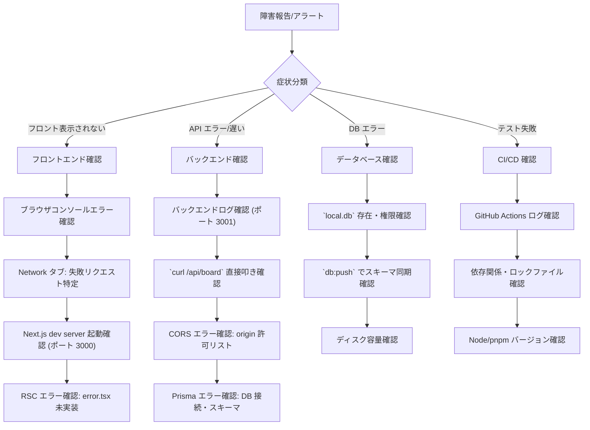

# 運用手順書

> **注意**: 本プロジェクトは開発・学習目的のスコープであり、本番運用を前提としていません。  
> 将来的に本番デプロイする場合は、本ドキュメントを大幅に拡張する必要があります。

## 1. 動作モード・環境変数

### 1.1 環境変数一覧

| 変数名 | 必須 | デフォルト | 説明 | 影響範囲 |
|--------|------|------------|------|----------|
| `NODE_ENV` | No | `development` | 実行モード | ログレベル、エラー詳細出力 |
| `PORT` | No | `3001` (Backend), `3000` (Frontend) | 待受ポート | サーバー起動、CORS |
| `DATABASE_URL` | No | `file:./local.db` | SQLite ファイルパス | DB 接続先 (Prisma) |
| `LOG_LEVEL` | No | `info` | ログレベル | 構造化ログ出力 (将来) |

### 1.2 モード別挙動

| モード | `NODE_ENV` | 挙動 |
|--------|------------|------|
| **開発** | `development` | 詳細エラー返却、ホットリロード、CORS 緩和 |
| **テスト** | `test` | インメモリ DB、モック有効、ログ抑制 |
| **本番** | `production` | エラー詳細非公開、HTTPS 強制、最適化ビルド |

### 1.3 設定ファイル優先順位

```
1. 環境変数 (最優先)
2. .env.local (ローカル上書き、Git 管理外)
3. .env (共通設定、Git 管理)
4. コード内デフォルト値
```

---

## 2. 日常運用オペレーション

### 2.1 開発環境起動

```bash
# 全サービス同時起動 (推奨)
pnpm dev
# → Backend: http://localhost:3001, Frontend: http://localhost:3000

# 個別起動
pnpm dev:backend    # http://localhost:3001 (tsx watch src/server.ts)
pnpm dev:frontend   # http://localhost:3000 (next dev)
```

### 2.2 データベース操作

| 操作 | コマンド | 説明 |
|------|----------|------|
| **スキーマ反映** | `pnpm --filter backend db:push` | `prisma db push` でスキーマ同期 (データ保持) |
| **マイグレーション** | 未実装 | `prisma migrate dev` (将来) |
| **Prisma Client 生成** | `pnpm --filter backend db:generate` | `prisma generate` (postinstall で自動実行) |
| **シード投入** | `pnpm --filter backend db:seed` | 初期カラム 3 つ投入 (べき等 `upsert`) |
| **DB リセット** | `rm apps/backend/local.db && pnpm --filter backend db:push && pnpm --filter backend db:seed` | 完全クリーンリセット |
| **データ確認** | `sqlite3 apps/backend/local.db ".tables"` / `.schema` / `SELECT * FROM tasks;` | SQLite CLI で直接確認 |
| **Prisma Studio** | `pnpm --filter backend exec prisma studio` | GUI でデータ閲覧・編集 |

### 2.3 テスト実行

```bash
# 全テスト (E2E 除く)
pnpm test

# パッケージ別
pnpm test:backend
pnpm test:frontend
pnpm test:shared

# カバレッジ付き
pnpm test --coverage

# 特定ファイル
pnpm --filter backend test src/index.test.ts
pnpm --filter frontend test components/Board.test.tsx

# E2E テスト
pnpm test:e2e
pnpm test:e2e:ui  # Playwright UI モード
```

### 2.4 型チェック・リント

```bash
# 全パッケージ型チェック
pnpm typecheck

# リント (Next.js 標準)
pnpm lint

# 自動修正
pnpm lint --fix
```

### 2.5 ビルド確認

```bash
# フロントエンド本番ビルド
pnpm --filter frontend build

# 出力確認
ls -la apps/frontend/.next/
```

---

## 3. ログの出力先と確認方法

### 3.1 現状のログ出力

| コンポーネント | 出力先 | フォーマット | レベル |
|----------------|--------|--------------|--------|
| **Backend (Hono)** | 標準出力 (tty) | 構造化なし (`console.log/error`) | 全レベル |
| **Frontend (Next.js)** | 標準出力 / ブラウザコンソール | 構造化なし | 全レベル |
| **Test (Vitest)** | 標準出力 | TAP / デフォルトリポーター | 全レベル |

### 3.2 ログ確認コマンド

```bash
# 開発サーバー起動時のログ確認
pnpm dev 2>&1 | tee dev.log

# バックエンドのみログ確認
pnpm dev:backend 2>&1 | tee backend.log

# テスト実行ログ
pnpm test 2>&1 | tee test.log
```

### 3.3 将来の構造化ログ仕様 (本番対応時)

```json
{
  "timestamp": "2026-10-02T12:34:56.789Z",
  "level": "info",
  "service": "backend",
  "traceId": "abc123",
  "spanId": "def456",
  "message": "Task created",
  "context": {
    "taskId": "t1",
    "columnId": "col-todo",
    "userId": "user-123"
  }
}
```

- 出力先: 標準出力 (コンテナログ収集基盤へ転送)
- 相関 ID: `traceId` / `spanId` でリクエスト追跡
- 機密情報: マスキング済み

---

## 4. 障害時の切り分け手順

### 4.1 症状別切り分けフロー



### 4.2 よくある障害と対処

| 症状 | 想定原因 | 確認コマンド | 対処 |
|------|----------|--------------|------|
| **フロントが真っ白** | RSC エラー / Next.js 起動失敗 | ブラウザ Console、Next.js ログ | `pnpm --filter frontend dev` 再起動 |
| **API が 500** | Prisma エラー / 未処理例外 | Backend ログ、 `curl /api/board` | DB リセット、スキーマ確認、Prisma 再生成 |
| **CORS エラー** | ポート不一致 / オリジン未許可 | Network タブ、Backend CORS 設定 | `cors({ origin: ['http://localhost:3000', 'http://localhost:3001'] })` 確認 |
| **型エラーでビルド失敗** | `AppType` 不整合 / Prisma generate 未実行 | `pnpm typecheck` | Backend 再型チェック、`pnpm --filter backend db:generate` |
| **テスト不安定 (Flaky)** | 非同期待機不足 / 状態リーク | `--reporter=verbose` 繰り返し実行 | `vi.useFakeTimers`、クリーンアップ強化 |
| **`pnpm install` 失敗** | Lockfile 不整合 / キャッシュ汚染 | `pnpm store prune` | `rm -rf node_modules pnpm-lock.yaml && pnpm install` |
| **Server Action 失敗** | RPC 接続エラー / バリデーション | ブラウザ Network、Backend ログ | `client` ベースURL 確認 (3001)、Zod スキーマ確認 |

### 4.3 エスカレーション基準

| レベル | 基準 | 対応 | 連絡先 |
|--------|------|------|--------|
| **L1 (開発者解決)** | 既知パターン、ドキュメント手順で解決 | 自己解決、作業ログ残す | - |
| **L2 (チーム相談)** | 原因不明、複数コンポーネント関与 | ペアデバッグ、Issue 起票 | チームリーダー |
| **L3 (緊急対応)** | 本番影響、データ消失リスク | 即時ロールバック、ホットフィックス | 全メンバー + ステークホルダー |

---

## 5. 鍵・認証情報の管理方針

### 5.1 現状
- **秘密情報なし**: API キー、DB パスワード、JWT 秘密鍵等一切使用しない
- **環境変数**: 開発時はデフォルト値のみ、`.env` ファイル不要

### 5.2 将来本番化時の方針

| 秘密情報 | 管理方式 | ローテーション | 保存場所 |
|----------|----------|----------------|----------|
| **DB 接続文字列** | 環境変数 / Secret Manager | 90 日 | GitHub Secrets / Cloud Secret Manager |
| **JWT 署名鍵** | KMS / Vault | 180 日 (鍵ペアローテーション) | KMS / Vault (平文保存禁止) |
| **外部 API キー** | 環境変数 / Secret Manager | 提供元仕様に準拠 | Secret Manager |
| **TLS 証明書** | ACME (Let's Encrypt) 自動更新 | 90 日 | リバースプロキシ / Cert Manager |

### 5.3 禁止事項
- ❌ ソースコードへの秘密情報ハードコーディング
- ❌ `.env` ファイルの Git コミット
- ❌ CI/CD ログへの秘密情報出力
- ❌ チャット・メール・ドキュメントでの秘密情報共有

---

## 6. 本番デプロイ前チェックリスト

### 6.1 コード品質
- [ ] `pnpm typecheck` パス (全パッケージ)
- [ ] `pnpm test` パス (全テスト、カバレッジ基準満たす)
- [ ] `pnpm test:e2e` パス (主要フロー)
- [ ] `pnpm audit` で高・致命的脆弱性 0 件
- [ ] TypeScript `strict: true` 維持

### 6.2 セキュリティ
- [ ] `docs/security.md#12-セキュリティチェックリスト-リリース前` すべて確認済み
- [ ] 環境変数に秘密情報含まない
- [ ] HTTPS/TLS 証明書有効・自動更新設定済み
- [ ] CORS オリジンが本番ドメインのみ
- [ ] セキュリティヘッダー設定済み

### 6.3 インフラ・設定
- [ ] `NODE_ENV=production` 設定済み
- [ ] 本番 DB (PostgreSQL / Turso) 接続確認済み
- [ ] マイグレーション実行済み (`prisma migrate deploy`)
- [ ] ヘルスチェックエンドポイント応答確認 (`GET /health` 将来実装)
- [ ] ログ収集・監視・アラート設定済み

### 6.4 機能確認
- [ ] 全 API エンドポイント手動動作確認 (`curl` 等)
- [ ] フロントエンド主要フロー E2E 確認 (Playwright)
- [ ] Drag & Drop・インライン編集動作確認
- [ ] Server Action 連携確認 (作成/削除/更新/移動)

### 6.5 ドキュメント・運用
- [ ] `README.md` デプロイ手順・URL 更新済み
- [ ] `docs/operations.md` 本番固有情報反映済み
- [ ] ランブック (障害対応手順) 整備済み
- [ ] オンコール体制・連絡フロー確立済み

---

## 7. バックアップ・リストア (将来)

| 対象 | 頻度 | 保持期間 | 方式 | リカバリ目標 (RTO/RPO) |
|------|------|----------|------|------------------------|
| **データベース** | 日次 / 継続的 (WAL) | 30 日 / 1 年 (アーカイブ) | マネージド DB 自動バックアップ | RTO: 1h / RPO: 5min |
| **設定・シークレット** | 変更時 | 永続 | Git / Secret Manager バージョニング | RTO: 15min / RPO: 0 |
| **アプリケーション コード** | コミット時 | 永続 | Git (main ブランチ保護) | RTO: 5min / RPO: 0 |

---

## 8. 容量計画・スケーリング (将来)

### 8.1 現状の限界
| リソース | 現在値 | 限界目安 | 対策 |
|----------|--------|----------|------|
| **SQLite 接続** | 1 プロセス | 同時書き込み 1 のみ | PostgreSQL / Turso 移行で複数レプリカ対応 |
| **メモリ** | ~100 MB (Next.js) | Node.js ヒープ 1.4 GB | 水平スケール (複数インスタンス) |
| **CPU** | 低負荷 | 単一コア | 負荷分散 (ロードバランサー) |
| **ディスク** | ~50 MB | ストレージ上限 | オブジェクトストレージ分離 |

### 8.2 スケーリング戦略
- **垂直スケール**: メモリ・CPU 増強 (限界あり)
- **水平スケール**: バックエンド複数インスタンス + 共有 DB (PostgreSQL/Turso)
- **CDN**: Vercel / Cloudflare でフロントエンド静的アセット配信
- **キャッシュ**: Redis 導入 (セッション、頻繁アクセスデータ)

---

## 9. メンテナンスウィンドウ

| 作業 | 頻度 | 推奨時間帯 | 所要時間 | ダウンタイム |
|------|------|------------|----------|--------------|
| **依存パッケージ更新** | 週次 | 平日日中 | 30 min | なし (ローリング) |
| **DB マイグレーション** | 必要時 | 低トラフィック時間 | 5-30 min | あり (読み取り専用モード) |
| **インフラパッチ** | 月次 | 深夜/早朝 | 60 min | あり (ブルーグリーン) |
| **証明書更新** | 90 日ごと | 自動 | - | なし |

---

## 10. 連絡先・エスカレーション

| 役割 | 担当 | 連絡手段 | 対応時間 |
|------|------|----------|----------|
| **開発責任者** | - | GitHub Issue / Slack | 平日 10:00-19:00 |
| **インフラ責任者** | - | GitHub Issue / Slack | 平日 10:00-19:00 |
| **セキュリティ窓口** | - | security@example.com | 24/7 (将来) |