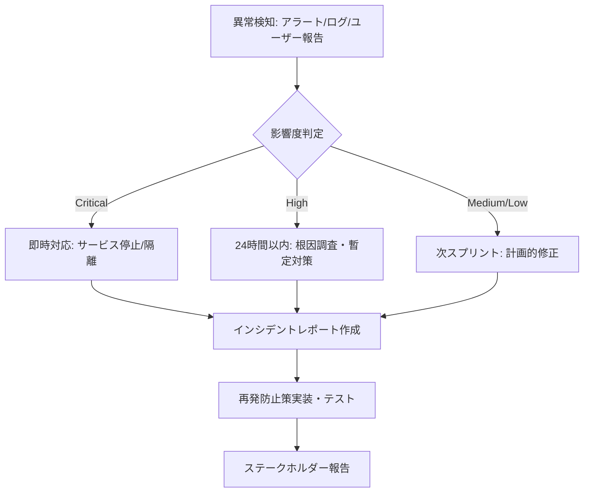

# セキュリティ設計書

> **注意**: 本プロジェクトは認証・認可・個人情報を扱わないスコープで開発されています。  
> 将来的に認証や機密データを扱う場合は、本ドキュメントを大幅に拡張する必要があります。

## 1. 保護対象と機密度

| データ種別 | 機密度 | 保護要件 | 現状 |
|------------|--------|----------|------|
| タスクタイトル・説明 | 低 (公開想定) | 改ざん防止、可用性 | バリデーションのみ |
| カラム構成 | 低 | 整合性 | シード固定 |
| データベースファイル | 中 | ファイルシステム権限 | `local.db` ローカル配置 |
| 通信内容 | 低 | 暗号化 (本番時) | 開発時 HTTP、本番 HTTPS 必須 |

**個人情報・認証情報・決済情報・機密業務データは一切扱わない**

---

## 2. 脅威モデル (STRIDE)

| 脅威カテゴリ | 適用性 | 対策状況 | 残存リスク |
|--------------|--------|----------|------------|
| **Spoofing** (なりすまし) | 低 (認証なし) | N/A | 全ユーザー同等権限 |
| **Tampering** (改ざん) | 中 | Zod バリデーション、Prisma パラメータ化クエリ | クライアント側改ざん検知なし |
| **Repudiation** (否認) | 低 | 監査ログなし | 操作履歴なし |
| **Information Disclosure** (情報漏洩) | 低 | データ公開想定、CORS 制限 | ネットワーク盗聴 (開発時 HTTP) |
| **Denial of Service** (DoS) | 低 | レート制限なし、SQLite ファイルロック | 大量リクエストで応答遅延・DB ロック |
| **Elevation of Privilege** (権限昇格) | 低 (認可なし) | N/A | 全操作全ユーザー実行可能 |

---

## 3. 認証・認可設計

### 現状
- **認証なし**: 全エンドポイント匿名アクセス許可
- **認可なし**: 全操作 (CRUD) 全ユーザー実行可能
- **セッション管理なし**: ステートレス

### 将来拡張時の設計方針
| 要素 | 採用技術 | 理由 |
|------|----------|------|
| **認証** | JWT (HS256/RS256) | ステートレス、Hono middleware 親和性 |
| **認可** | Role-Based Access Control (RBAC) | シンプル、タスク単位権限に拡張可能 |
| **セッション** | HttpOnly Secure Cookie + CSRF トークン | XSS 耐性、CSRF 対策 |
| **パスワード** | Argon2id (ハッシュ) | 将来標準、タイミング攻撃耐性 |

---

## 4. 入力バリデーション・サニタイズ

### 4.1 バックエンド (単一正本: `docs/api.md`)

| エンドポイント | バリデーション | 実装 |
|----------------|----------------|------|
| `POST /api/tasks` | `insertTaskSchema` (Zod) | `@hono/zod-validator` で自動適用 |
| `PATCH /api/tasks/move` | `moveTaskSchema` (Zod) | 同上 |
| `PUT /api/tasks/update` | `updateTaskSchema` (Zod) | 同上 |

**バリデーションルール詳細**: [`docs/api.md#7-バリデーションルール詳細`](api.md#7-バリデーションルール詳細) を参照

### 4.2 フロントエンド

| 箇所 | バリデーション | 実装 |
|------|----------------|------|
| タスク作成フォーム | `insertTaskSchema` (Zod) | Conform `useForm` + `parseWithZod` (Server Action 前) |
| タスク編集フォーム | `updateTaskSchema` (Zod) | 同上 (Server Action 前) |

### 4.3 共通原則

- **二重バリデーション**: フロント (UX) + バックエンド (セキュリティ正本)
- **許可リスト方式**: 許可されるフィールドのみ受け付け (Zod `strict` 暗黙)
- **サニタイズ**: HTML エスケープは出力時 (React 自動エスケープ信頼)、DB 格納時は生文字列保存

---

## 5. インジェクション対策

### 5.1 SQL インジェクション
- **対策**: Prisma ORM のパラメータ化クエリ (プレースホルダ) を全クエリで使用
- **生 SQL 禁止**: `$queryRaw` / `$executeRaw` 使用時もパラメータ化必須、文字列結合絶対禁止

```typescript
// ✅ 安全: Prisma パラメータ化
await db.task.updateMany({ where: { id }, data: { columnId, position } })

// ❌ 危険: 文字列結合 (禁止)
// await db.$executeRaw`UPDATE tasks SET column_id = ${columnId} WHERE id = ${id}`
```

### 5.2 XSS (Cross-Site Scripting)
- **対策**: React の JSX 自動エスケープを信頼
- **危険 API 禁止**: `dangerouslySetInnerHTML` 使用禁止
- **ユーザー入力表示**: 全て `{task.title}`, `{task.description}` 等で出力 (自動エスケープ)

### 5.3 CSRF (Cross-Site Request Forgery)
- **現状**: 同一オリジン (開発時) + 認証なしのためリスク低
- **本番時対策**: 
  - `SameSite: 'Lax'` Cookie + CSRF トークン (Double Submit Cookie パターン)
  - Next.js Server Actions はデフォルトで CSRF 保護 (Origin チェック)

---

## 6. 通信セキュリティ

### 6.1 CORS 設定
```typescript
// apps/backend/src/index.ts
app.use('/api/*', cors({ origin: ['http://localhost:3000', 'http://localhost:3001'] }))
```
- 開発時: `http://localhost:3000` (Frontend), `http://localhost:3001` (Backend) のみ許可
- 本番時: 具体的なフロントエンドドメインのみ許可 (ワイルドカード禁止)

### 6.2 HTTPS/TLS
| 環境 | プロトコル | 証明書 |
|------|------------|--------|
| 開発 | HTTP | なし (localhost 信頼) |
| 本番 | HTTPS (TLS 1.3) | Let's Encrypt / 管理証明書 |

### 6.3 セキュリティヘッダー (本番時推奨)
```typescript
// Hono ミドルウェアで追加予定 (helmet 相当)
app.use('*', secureHeaders())
```
- `Content-Security-Policy`: スクリプト・スタイル・フォントソース制限
- `X-Frame-Options: DENY`: クリックジャッキング防止
- `X-Content-Type-Options: nosniff`: MIME スニッフィング防止
- `Referrer-Policy: strict-origin-when-cross-origin`
- `Permissions-Policy`: カメラ・マイク・位置情報等無効化

---

## 7. 暗号化・鍵管理

### 現状
- **保存時暗号化**: なし (SQLite 平文ファイル)
- **通信時暗号化**: 開発時なし、本番時 TLS
- **鍵管理**: 該当なし

### 将来拡張時
| 対象 | 方式 | 鍵管理 |
|------|------|--------|
| **DB 暗号化** | SQLCipher / Turso 暗号化 | 環境変数でマスターキー注入、KMS 連携 |
| **JWT 署名** | RS256 (非対称) | 秘密鍵: KMS / Vault、公開鍵: JWKS エンドポイント公開 |
| **API キー** | HMAC-SHA256 | ハッシュ保存、プレフィックス付き発行 |

---

## 8. 攻撃対策まとめ

| 攻撃種別 | 対策 | 実装箇所 | 検証方法 |
|----------|------|----------|----------|
| **SQL インジェクション** | Prisma パラメータ化クエリ | `apps/backend/src/index.ts` | コードレビュー、SAST |
| **XSS** | React 自動エスケープ、`dangerouslySetInnerHTML` 禁止 | `apps/frontend/components/*.tsx` | ESLint ルール、手動確認 |
| **CSRF** | 開発時 CORS 制限、本番時 CSRF トークン + Server Actions 保護 | Backend CORS、Server Actions | OWASP ZAP スキャン |
| **パストラバーサル** | ファイル操作なし | N/A | N/A |
| **XXE** | XML パースなし | N/A | N/A |
| **SSRF** | 外部 HTTP 要求なし | N/A | N/A |
| **DoS** | 将来: レート制限 (Hono `rateLimiter`) | 未実装 | 負荷テスト |

---

## 9. ログと監査

### 現状
- **アクセスログ**: なし (開発時コンソール出力のみ)
- **エラーログ**: `console.error` (未構造化)
- **監査ログ**: なし

### 将来拡張時の要件
| ログ種別 | 内容 | 保存期間 | 出力先 |
|----------|------|----------|--------|
| **アクセスログ** | リクエストライン、IP、UA、レスポンスステータス、レイテンシ | 90 日 | 構造化 JSON (stdout → ログ集約基盤) |
| **エラーログ** | スタックトレース、リクエストコンテキスト、ユーザー ID | 1 年 | 同上 + アラート通知 |
| **監査ログ** | 誰が・いつ・何のリソースを・どう操作したか (CRUD) | 2 年 | 改ざん検知付きストレージ |

### 機密情報マスキング
- ログに **出力しない**: パスワード、トークン、API キー、個人情報
- マスキング対象: `Authorization` ヘッダー、Cookie、リクエストボディ機密フィールド

---

## 10. 既知のリスクと残存課題

| リスクID | 説明 | 影響度 | 可能性 | 対応状況 | 対応計画 |
|----------|------|--------|--------|----------|----------|
| **SEC-001** | 認証なしで全操作可能 | 高 | 高 | 受容 (スコープ外) | 認証実装時に解消 |
| **SEC-002** | HTTP 通信で盗聴可能 | 中 | 中 (開発環境) | 受容 | 本番 HTTPS 強制 |
| **SEC-003** | レート制限なしで DoS 可能 | 中 | 低 | 受容 | `hono/rate-limiter` 導入 |
| **SEC-004** | 操作履歴・監査証跡なし | 低 | 高 | 受容 | 監査ログ実装時に解消 |
| **SEC-005** | SQLite ファイル物理アクセスで全データ閲覧可能 | 中 | 低 (ローカル開発) | 受容 | 本番はマネージド DB (Turso/PostgreSQL) 移行 |
| **SEC-006** | 依存ライブラリの脆弱性 | 中 | 中 | 定期更新 | `pnpm audit` 定期実行、Dependabot |

---

## 11. インシデント対応フロー (将来)



---

## 12. セキュリティチェックリスト (リリース前)

- [ ] `pnpm audit` で高・致命的脆弱性 0 件
- [ ] `tsc --noEmit` で型エラー 0 件 (型安全性確保)
- [ ] 全 API エンドポイントに Zod バリデーション適用済み
- [ ] CORS オリジンが本番ドメインのみに制限済み
- [ ] HTTPS 強制 (HSTS ヘッダー含む)
- [ ] セキュリティヘッダー (CSP, X-Frame-Options 等) 設定済み
- [ ] `dangerouslySetInnerHTML` 使用箇所 0 件
- [ ] 生 SQL / 文字列結合クエリ 0 件
- [ ] 環境変数に秘密情報含まない (`.env` コミットなし)
- [ ] 依存パッケージが最新安定版 (セキュリティパッチ適用済み)